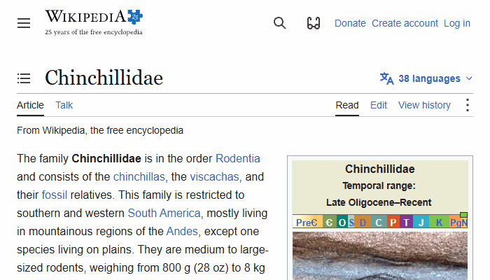

# demo-gifs
Generate an animated GIF of a webpage being scrolled from top to bottom. Useful for creating quick demos of web projects.

## :camera: Example


## :package: Installation
**Required:** Node.js 22.12.0 or later
```shell
git clone https://github.com/claudiacachayosorio/demo-gifs.git
cd demo-gifs
npm install
```

## :keyboard: Usage
```shell
npm start -- URL OUTPUT
npm start -- https://example.com demo.gif
```
* `URL` — webpage to capture
* `OUTPUT` — path for generated GIF (relative or absolute)

## :memo: Notes
* Webpage is captured at fixed viewport size: 700 x 400 px.

## :hammer_and_wrench: Development
```shell
# Run test suite
npm test
# Run all checks
npm check
```

## :bulb: Inspiration
* [Build a screenshot pipeline](https://www.codementor.io/projects/web/build-a-screenshot-pipeline-c22ccscro8) by Raphael Sztwiorok
* [Using Puppeteer to make animated GIFs of page scrolls](https://dev.to/aimerib/using-puppeteer-to-make-animated-gifs-of-page-scrolls-1lko) by Aimeri Baddouh
